# 🏥 MediCore HMS — Hospital Management System

> Built with **AI-assisted development (Vibe Coding)** — where human logic meets AI efficiency.

A full-stack Hospital Management System built with Java Servlets, JDBC, MySQL, and a cinematic HTML/CSS/JS frontend, deployed on Apache Tomcat 10.

---

## 👨‍💻 Developer Role

**AI Full Stack Developer** — This project was developed using an AI-assisted workflow (Vibe Coding), where I leveraged AI tools to accelerate development while maintaining full understanding and ownership of the architecture, logic, and deployment.

> *"I didn't just use AI as a shortcut — I used it as a force multiplier. Every line of code was reviewed, debugged, and deployed by me."*

---

## 🤖 AI Vibe Coding Approach

This project follows the **Vibe Coding** methodology — a modern development approach where:

- 💡 **Architecture & Logic** → Designed by the developer
- ⚡ **Code Generation** → Accelerated using AI assistance
- 🐛 **Debugging & Deployment** → Handled entirely by the developer
- 🧠 **Understanding** → Every module fully understood and owned

This is not copy-paste development. Every servlet, every SQL query, every deployment error was understood, tested, and resolved hands-on.

---

## 📸 UI Screenshots

### 🏠 Home / Landing Page
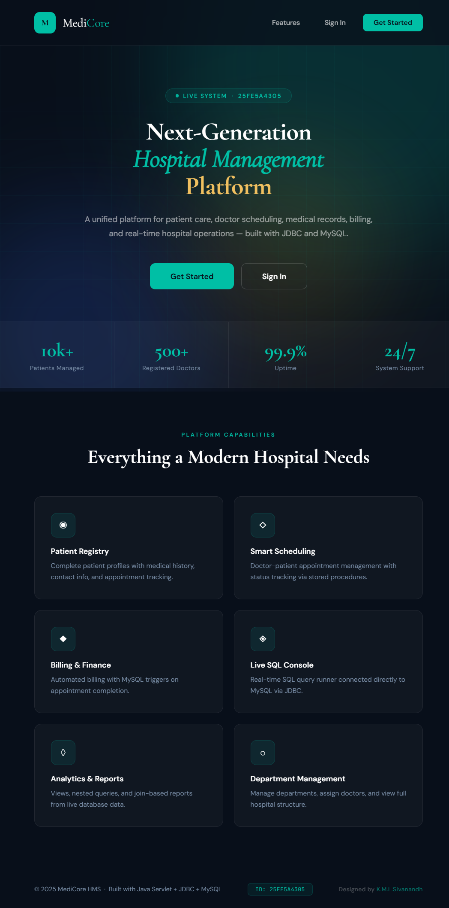

### 🔐 Login Page
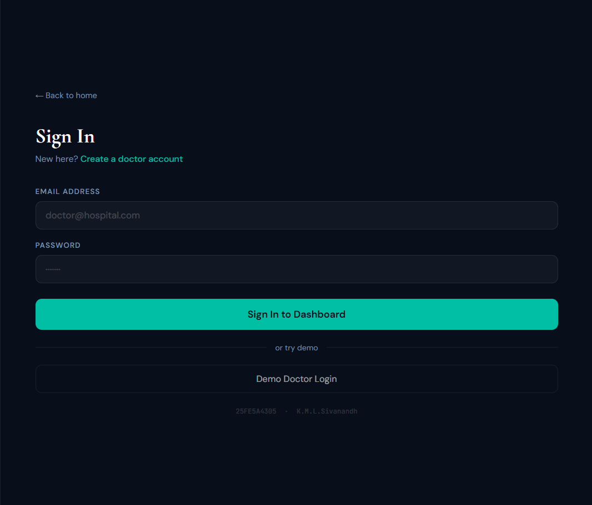

### 📝 Register Page
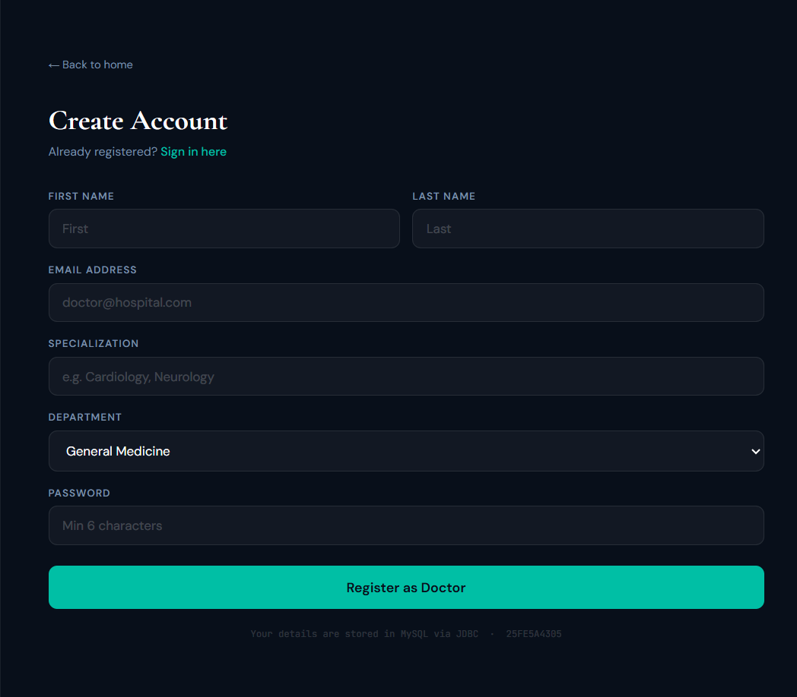

### 📊 Dashboard
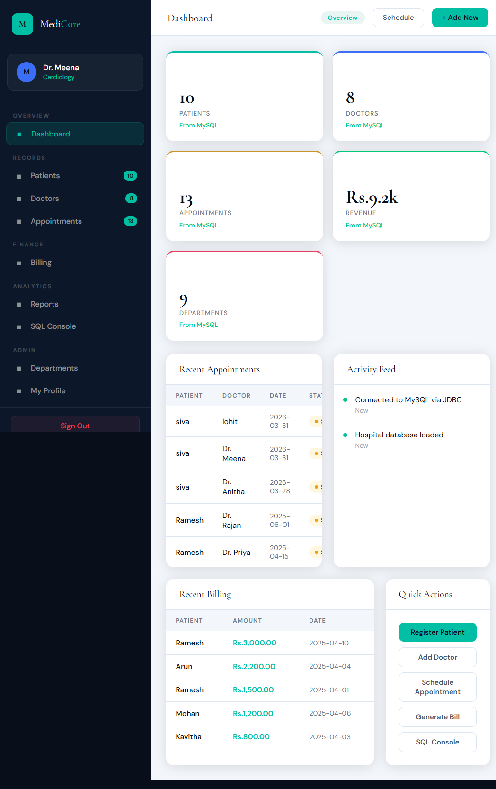

### 🧑‍⚕️ Patient Management
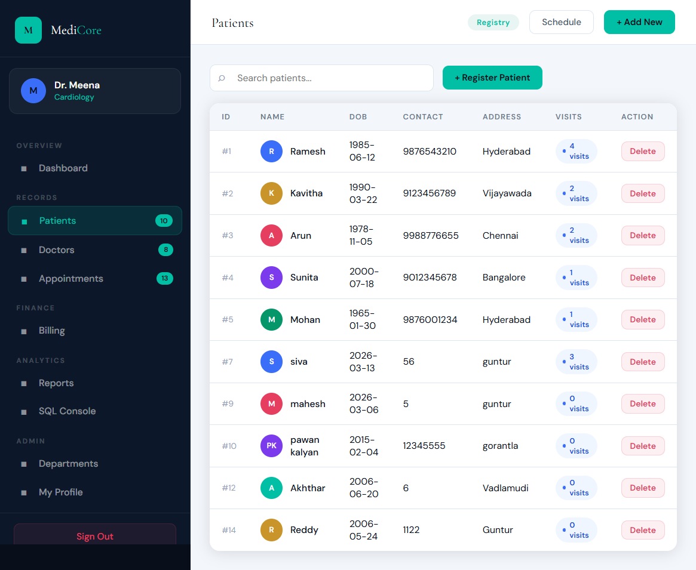

### 👨‍⚕️ Doctor Management
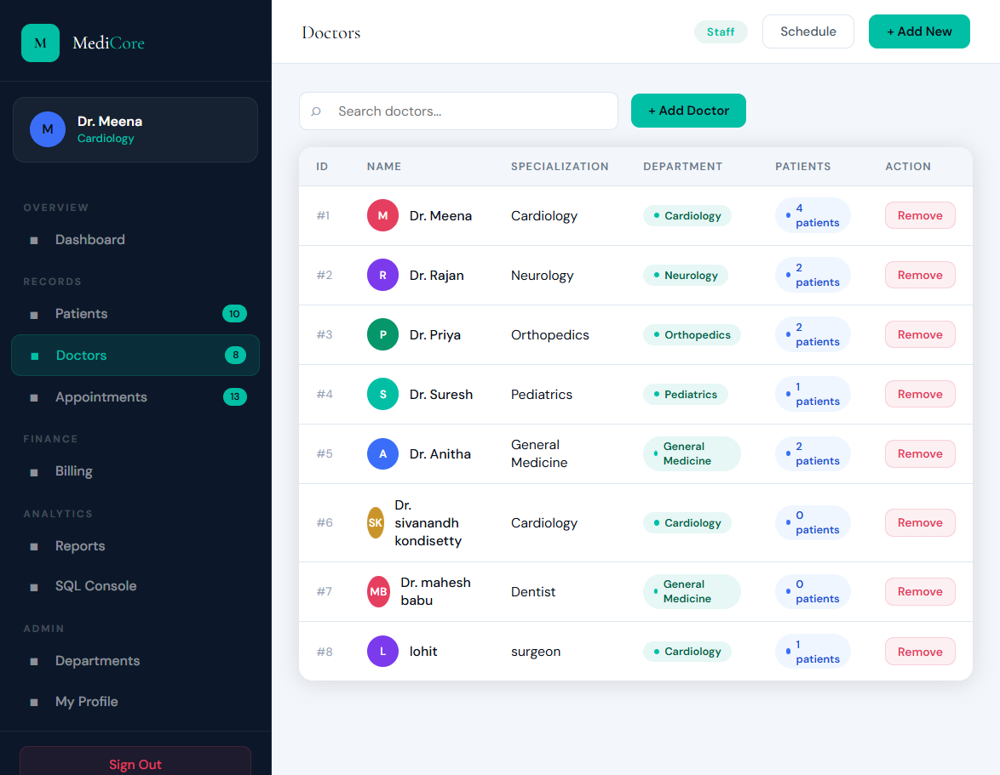

### 📅 Appointment Scheduling
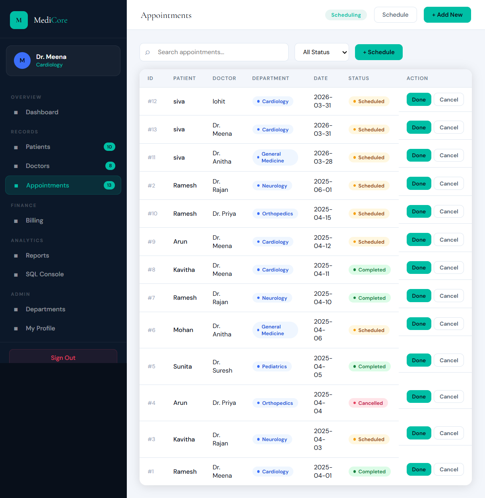

### 💳 Billing System
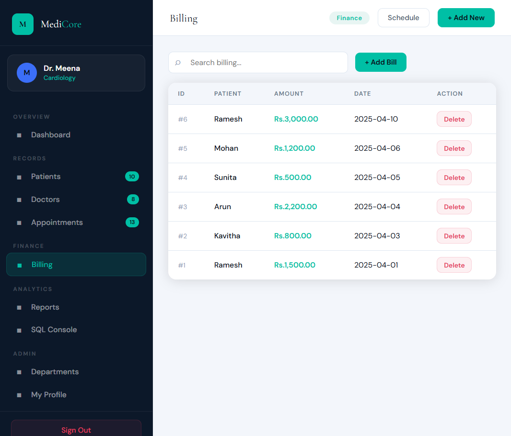

### 🏢 Department Management
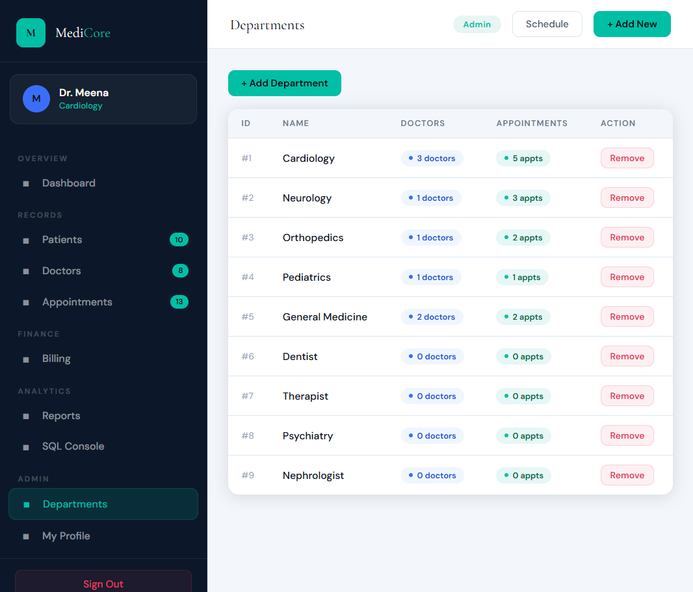

### 🖥️ SQL Console
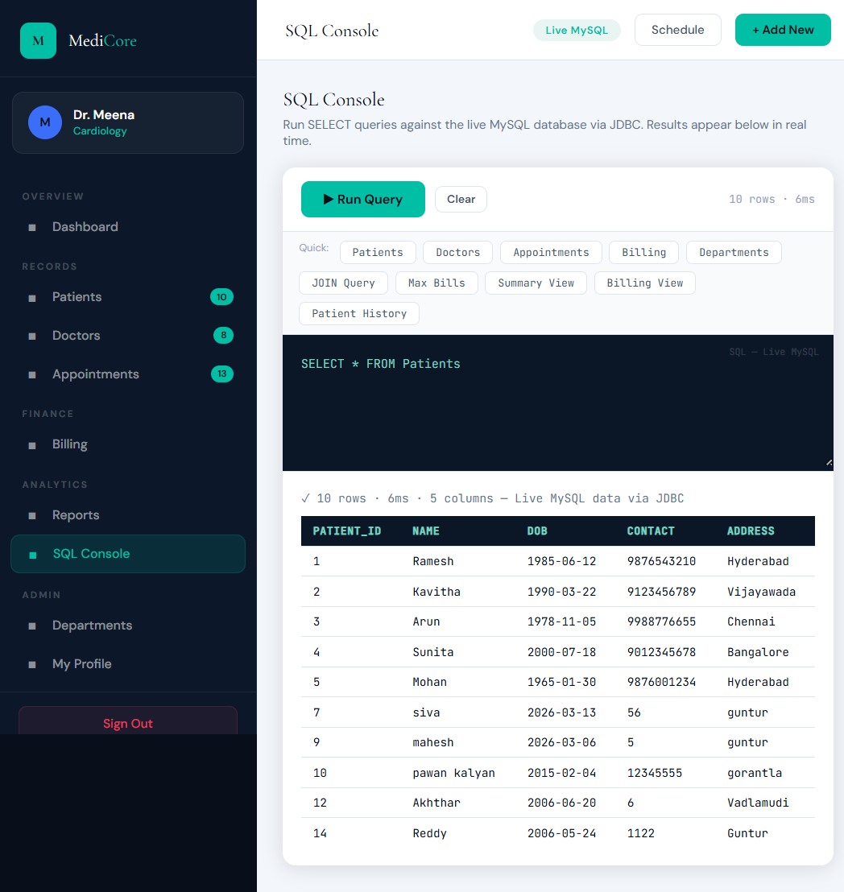

### 📊 Reports
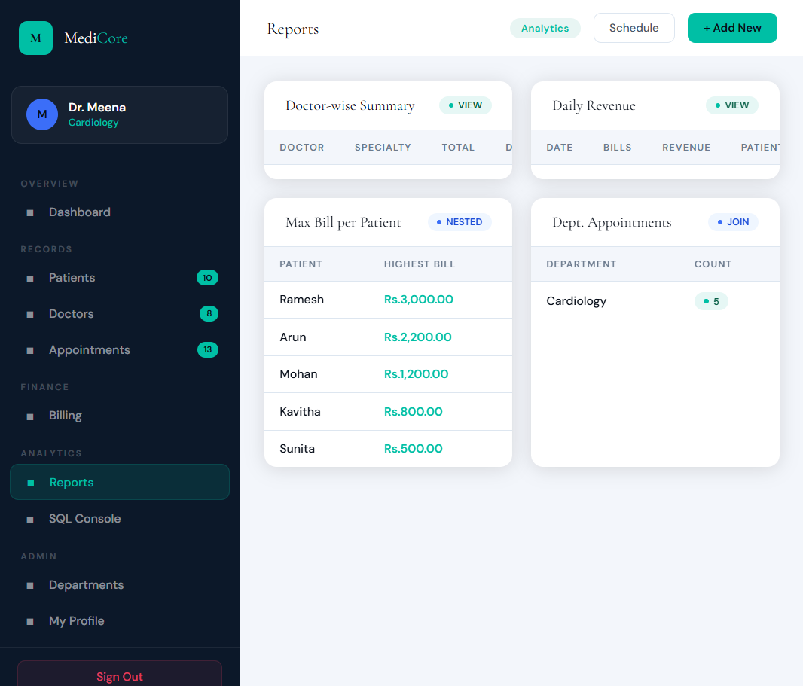

### 👤 Profile
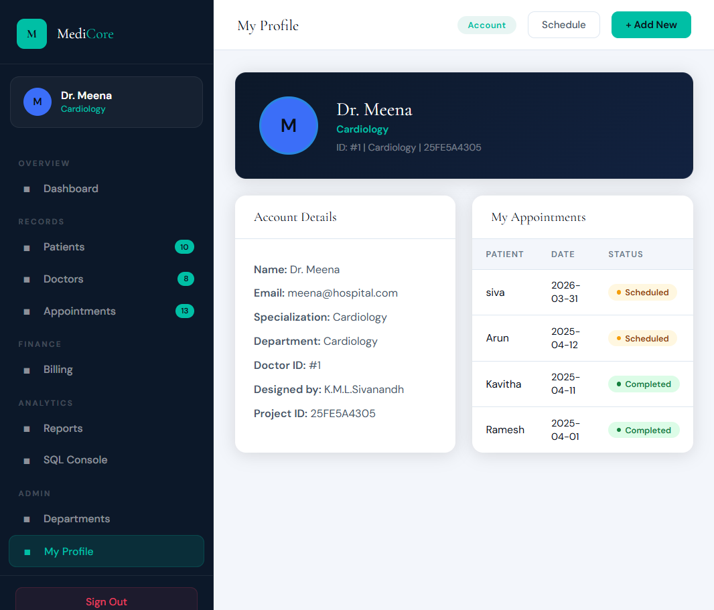

---

## 🚀 Tech Stack

| Layer | Technology |
|-------|-----------|
| Frontend | HTML, CSS, JavaScript |
| Backend | Java Servlets (Jakarta EE) |
| Database | MySQL |
| Server | Apache Tomcat 10 |
| Connectivity | JDBC (mysql-connector-j-9.6.0) |
| AI Assistance | Vibe Coding (AI-augmented development) |

---

## ⚙️ Features

- 🔐 Authentication (Login / Register / Logout)
- 🧑‍⚕️ Patient Management (Add, View, Update, Delete)
- 👨‍⚕️ Doctor Management
- 📅 Appointment Scheduling
- 🏢 Department Management
- 💳 Billing System
- 📊 Reports Generation
- 🖥️ SQL Console
- 👤 Profile Management
- 🔒 CORS Filter for API Security

---

## 🗄️ Database Design

- **5 Tables** — patients, doctors, appointments, billing, departments
- **Stored Procedures** — for reusable DB logic
- **Triggers** — for automated DB actions
- **Views** — for simplified data retrieval
- **Join & Nested Queries** — for complex data operations

---

## 📁 Project Structure

```
MediCore-HMS/
├── src/
│   └── com/hospital/servlet/
│       ├── AuthServlet.java
│       ├── PatientServlet.java
│       ├── DoctorServlet.java
│       ├── AppointmentServlet.java
│       ├── BillingServlet.java
│       ├── DepartmentServlet.java
│       ├── ReportServlet.java
│       ├── SqlServlet.java
│       ├── CORSFilter.java
│       └── DBConnection.java
├── WebContent/
│   ├── index.html
│   ├── api.js
│   └── WEB-INF/
│       ├── web.xml
│       └── lib/
│           └── mysql-connector-j-9.6.0.jar
├── screenshots/
├── .env.example
└── .gitignore
```

---

## 🛠️ Setup Instructions

### Prerequisites
- Java JDK 11+
- Apache Tomcat 10
- MySQL Server
- MySQL Connector JAR (included in `WebContent/WEB-INF/lib/`)

### Database Setup
1. Create a MySQL database named `hospital_db`
2. Import your SQL schema

### Environment Variables
Copy `.env.example` and set your database credentials:
```
DB_URL=jdbc:mysql://localhost:3306/hospital_db
DB_USER=your_mysql_username
DB_PASS=your_mysql_password
```

### Deployment
1. Compile the Java source files:
```cmd
javac -cp "path\to\tomcat\lib\servlet-api.jar;WebContent\WEB-INF\lib\mysql-connector-j-9.6.0.jar" -d "WebContent\WEB-INF\classes" src\com\hospital\servlet\*.java
```
2. Copy the `WebContent` folder to `tomcat/webapps/hospital/`
3. Start Tomcat and visit `http://localhost:8080/hospital/`

---

## 🧠 Key Learnings

- Resolved **Java 11 incompatibility** with Jakarta EE Servlet API
- Fixed **UTF-8 BOM corruption** in source files
- Debugged **classpath issues** during manual compilation
- Mastered **Tomcat 10 deployment workflow** using CMD
- Implemented **environment variable based credential management**
- Applied **AI Vibe Coding** methodology in real-world project development

---

## 👨‍💻 Author

**Sivanandh Kondisetty**
B.Tech AI Student — Vignan's Lara Institute of Technology & Science, Guntur
AI Full Stack Developer | Vibe Coder
GitHub: [@SivanandhKondisetty](https://github.com/SivanandhKondisetty)

---

## 📄 License

This project is open source and available under the [MIT License](LICENSE).
